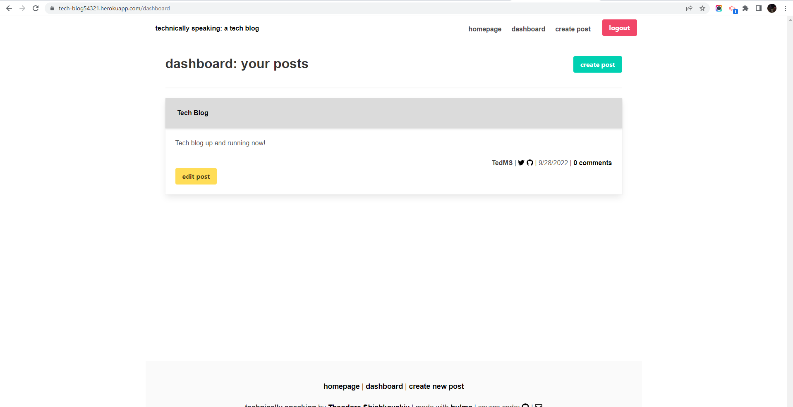

## MVC Tech-Blog

## Table of Contents
- [Description](#description)
- [Table of Contents](#table-of-contents)
- [Installation](#installation)
- [Contributing](#contributing)
- [Questions](#questions)
   
## Description

*This is a MySql Database and CMS-style Blog built using Model View Controller (MVC) paradigm. Built using MySQL2, Express, Sequelize, Bulma, Handlebars and dotenv*

## Application Deployment

https://git.heroku.com/tech-blog54321.git

## Application Screenshot

🎥
  

## Installation

- Add a .env file to the root of the project

```text
DB_NAME='tech_blog_db'
DB_USER='root'
DB_PW='XXX'
```

## Contributing
:octocat: [Theodore Shishkovskiy](https://github.com/TheodoreShishkovskiy)💻

## Questions
✉️ Contact me with any questions: [email](mailto:tmshishkovskiy@gmail.com) , [GitHub](https://github.com/TheodoreShishkovskiy)<br />